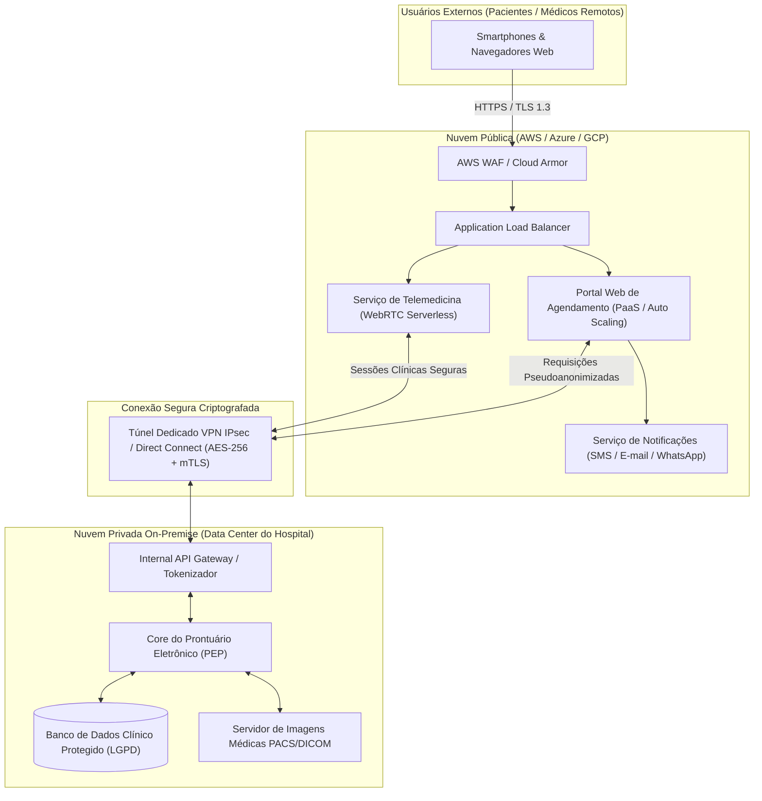

# RELATÓRIO TÉCNICO E PRÁTICO: COMPUTAÇÃO EM NUVEM I
## Contextualização, Modelos de Implantação, Características, Desafios e Modelos de Serviço em Nuvem

| Aluno(a) | Turma | Formato de entrega |
| :--- | :--- | :--- |
| **Otávio Vianna Lima** | **Computação em Nuvem I** | Relatório técnico com respostas dissertativas fundamentadas, matrizes comparativas e evidências de prática hands-on. |

---

## PARTE 1 — ATIVIDADE TEÓRICA (PESQUISA DIRIGIDA)

### Bloco 1 — Contextualização e Modelos de Implantação

#### 1. O que caracteriza um sistema de computação em nuvem em comparação com a infraestrutura de TI tradicional (on-premise)? Cite pelo menos três diferenças.

**Resposta:**
Um sistema de computação em nuvem caracteriza-se fundamentalmente por fornecer recursos de computação (processamento, armazenamento, redes e softwares) como um **serviço entregue sob demanda via rede**, abstraindo a camada de hardware físico do usuário final. Conforme a definição formal do *National Institute of Standards and Technology* (NIST SP 800-145), trata-se de um modelo que viabiliza o acesso onipresente, conveniente e compartilhado a um conjunto de capacidades computacionais configuráveis com mínimo esforço de gestão.

Em contrapartida, a TI tradicional (*on-premise*) baseia-se na aquisição, instalação e operação direta de ativos físicos proprietários dentro do próprio data center da organização. As três principais diferenças estruturais são:

1. **Modelo Financeiro e Contábil (CapEx vs. OpEx):**
   * *TI Tradicional:* Opera no modelo **CapEx** (*Capital Expenditure*), exigindo volumosos aportes financeiros antecipados na compra de servidores, licenças perpétuas, geradores, no-breaks, climatização e cabeamento, com ciclo de amortização e depreciação fiscal de longo prazo.
   * *Nuvem:* Transfere a infraestrutura para o modelo **OpEx** (*Operational Expenditure*), no qual não há investimento prévio em ativos físicos; a organização paga apenas pelo consumo operacional efetivo (*pay-as-you-go*), transformando despesas fixas em variáveis previsíveis.
2. **Elasticidade, Tempo de Provisionamento e Dimensionamento de Capacidade:**
   * *TI Tradicional:* O planejamento de capacidade (*capacity planning*) é estático. Para suportar picos sazonais (como Black Friday), a empresa precisa superdimensionar o hardware, gerando ociosidade onerosa na maior parte do ano. A compra e instalação de novos servidores físicos pode demorar de semanas a meses (aquisição, importação, homologação e cabeamento).
   * *Nuvem:* Possui **elasticidade rápida**. Instâncias virtuais, bancos de dados ou contêineres podem ser provisionados ou desativados em questão de segundos ou minutos, de forma automatizada por métricas de demanda, eliminando tanto a falta de recursos quanto o desperdício por ociosidade.
3. **Escopo de Responsabilidade Operacional e Manutenção de Hardware:**
   * *TI Tradicional:* A equipe de TI interna é responsável por todas as camadas: manutenção corretiva e preventiva de hardware físico, substituição de discos danificados (*RAID rebuilds*), energia, refrigeração, atualizações de firmware e segurança perimetral física do prédio.
   * *Nuvem:* A manutenção e a resiliência do hardware físico, hipervisores e instalações são de responsabilidade exclusiva do provedor de nuvem (*cloud provider*), garantidas por rígidos Acordos de Nível de Serviço (*SLA - Service Level Agreement*). Isso libera a equipe técnica da empresa para focar em valor de negócio, desenvolvimento de software e governança de dados.

*Fontes consultadas:*
* MELL, P.; GRANCE, T. *The NIST Definition of Cloud Computing*. NIST Special Publication 800-145, 2011. Disponível em: <https://csrc.nist.gov/publications/detail/sp/800-145/final>.
* AWS. *Cloud Economics Center: CapEx to OpEx*. Disponível em: <https://aws.amazon.com/financial-services/cloud-economics/>.

---

#### 2. Defina, com suas palavras, nuvem pública, nuvem privada e nuvem híbrida. Para cada uma, apresente um exemplo real de provedor ou de caso de uso corporativo.

**Resposta:**

* **Nuvem Pública (*Public Cloud*):**
  * *Definição:* É um ambiente no qual a infraestrutura física de servidores, redes e armazenamento pertence a uma empresa terceira e é compartilhada por múltiplos clientes distintos (*multi-tenant*). Embora os recursos físicos sejam compartilhados, os dados e aplicações de cada cliente são estritamente isolados em nível lógico (por virtualização, criptografia e políticas de rede). O acesso ocorre publicamente via internet ou links dedicados.
  * *Exemplo real / Caso de uso:* Provedores líderes incluem **Amazon Web Services (AWS)**, **Microsoft Azure** e **Google Cloud Platform (GCP)**. Um caso corporativo emblemático é a **Netflix**, que desativou seus data centers legados e migrou toda a sua lógica de microsserviços, inteligência de recomendação e processamento de streaming de vídeo para a infraestrutura pública da AWS, atendendo a mais de 200 milhões de clientes globais com alta escalabilidade.
* **Nuvem Privada (*Private Cloud*):**
  * *Definição:* É a infraestrutura computacional dedicada ao uso exclusivo de uma única organização (*single-tenant*). Pode ser hospedada fisicamente no próprio data center local da empresa (*on-premise*) ou em instalações de colocation terceirizadas, operando com tecnologias de virtualização e orquestração que oferecem a flexibilidade e o autoatendimento da nuvem, mas com isolamento físico completo e controle irrestrito sobre dados, políticas e arquitetura.
  * *Exemplo real / Caso de uso:* Implementações baseadas em plataformas de orquestração de nuvem privada como **OpenStack**, **VMware Cloud Foundation (vSphere)** ou **Red Hat OpenShift on-premises**. Um exemplo corporativo prático são as **Forças Armadas ou Agências de Inteligência de Defesa**, que mantêm nuvens privadas físicas totalmente desconectadas da internet (*air-gapped*) para processamento de informações bélicas e de segurança nacional.
* **Nuvem Híbrida (*Hybrid Cloud*):**
  * *Definição:* É a composição arquitetural integrada entre duas ou mais infraestruturas de nuvem distintas (obrigatoriamente pelo menos uma nuvem privada e pelo menos uma nuvem pública). As infraestruturas permanecem como entidades autônomas, mas são interligadas por meio de redes seguras (VPNs IPsec ou links dedicados como AWS Direct Connect / Azure ExpressRoute) e ferramentas de orquestração unificada, permitindo a portabilidade segura de dados e cargas de trabalho entre os ambientes.
  * *Exemplo real / Caso de uso:* Soluções como **Azure Arc**, **AWS Outposts** e **Google Distributed Cloud (Anthos)**. Um exemplo corporativo clássico é o **Itaú Unibanco**, que utiliza nuvem privada/mainframes legados on-premise para transações bancárias ultracríticas e guarda do histórico de contas, enquanto orquestra na AWS/Azure aplicações móveis voltadas ao cliente, pipelines de *Machine Learning* e APIs de *Open Finance* sujeitas a picos súbitos de acesso.

*Fontes consultadas:*
* MELL, P.; GRANCE, T. *The NIST Definition of Cloud Computing*. NIST SP 800-145, 2011.
* AWS CASE STUDIES. *Netflix on AWS: Migrating to the Cloud*. Disponível em: <https://aws.amazon.com/solutions/case-studies/netflix/>.
* MICROSOFT LEARN. *O que é nuvem híbrida?*. Disponível em: <https://learn.microsoft.com/pt-br/azure/cloud-adoption-framework/strategy/hybrid-cloud>.

---

#### 3. Em que situações uma organização optaria por uma nuvem híbrida em vez de uma nuvem pública pura? Utilize como referência um setor fortemente regulado (por exemplo, bancário, saúde ou governo) e explique o motivo da escolha.

**Resposta:**
Uma organização opta por um modelo de nuvem híbrida quando precisa conciliar a **agilidade, escalabilidade e inovação da nuvem pública** com a **necessidade mandatória de soberania de dados, latência ultrabaixa ou conformidade regulatória estrita** que apenas um ambiente privado/on-premise pode garantir integralmente.

Tomando como referência o **Setor Bancário e Financeiro Brasileiro** (regulado pelo Banco Central do Brasil - BACEN e pelo Conselho Monetário Nacional - CMN, sob as resoluções **CMN nº 4.893/2020** e **BCB nº 85/2021** sobre segurança cibernética e contratação de serviços de computação em nuvem), a escolha pela nuvem híbrida ocorre pelos seguintes motivos determinantes:

1. **Conformidade Regulatória e Auditoria Física Estrita:**
   O BACEN exige que as instituições financeiras assegurem a continuidade dos serviços essenciais, garantam o sigilo bancário (Lei Complementar nº 105/2001) e comprovem a capacidade de auditoria física dos registros quando solicitado. Em uma nuvem pública pura multitenant, o banco não tem o direito de inspecionar fisicamente o rack de servidores do provedor em virtude da privacidade dos outros clientes. Na nuvem privada, o banco mantém a custódia física dos livros contábeis e das chaves de criptografia primárias (HSMs dedicados).
2. **Latência de Milissegundos em Transações de Compensação (*Core Banking*):**
   Sistemas de liquidação de pagamentos instantâneos (como o SPB - Sistema de Pagamentos Brasileiro e o PIX) exigem tempos de resposta na casa dos milissegundos. Manter as transações centrais de débito/crédito em servidores dedicados on-premise conectados via barramentos locais de altíssima velocidade elimina riscos de oscilação de tráfego de internet pública.
3. **Proteção contra *Vendor Lock-in* e Continuidade Operacional:**
   Regulamentações financeiras exigem planos de contingência e mitigação de risco de concentração em um único fornecedor externo. A arquitetura híbrida assegura que, em caso de indisponibilidade regional grave ou litígio comercial com o provedor de nuvem pública, o núcleo bancário vital continua funcionando localmente.
4. **Alavancagem de Canais Digitais na Nuvem Pública:**
   Por outro lado, o banco utiliza a ponta pública da nuvem híbrida para hospedar seu aplicativo de Internet Banking, portais de atendimento, chatbots de IA generativa e processamento elástico de campanhas comerciais, aproveitando o *auto scaling* para aguentar dias de pagamento e fechamento de mês sem sobrecarregar a infraestrutura interna.

*Fontes consultadas:*
* BANCO CENTRAL DO BRASIL. *Resolução CMN nº 4.893, de 23 de dezembro de 2020*. Dispõe sobre a política de segurança cibernética e sobre os requisitos para a contratação de serviços de processamento e armazenamento de dados e de computação em nuvem a serem observados pelas instituições financeiras. Disponível em: <https://www.bcb.gov.br/estabilidadefinanceira/exibenormativo?tipo=Resolu%C3%A7%C3%A3o%20CMN&numero=4893>.

---

#### 4. Pesquise o conceito de "nuvem comunitária" (community cloud). Ele é reconhecido pela definição oficial do NIST? Em que esse modelo se diferencia da nuvem privada?

**Resposta:**
**Sim, a nuvem comunitária é expressamente reconhecida e normatizada pela definição oficial do NIST (SP 800-145, Seção 2.3).** O documento lista formalmente quatro modelos de implantação: *Private Cloud*, *Community Cloud*, *Public Cloud* e *Hybrid Cloud*.

* **Conceito pelo NIST:**
  A nuvem comunitária é a infraestrutura provisionada para uso exclusivo de uma comunidade específica de organizações consumidoras que compartilham interesses e requisitos em comum — como uma mesma missão institucional, diretrizes de segurança da informação, necessidades de conformidade jurídica, regulamentações governamentais ou metas operacionais afins. Essa infraestrutura pode ser de propriedade, gerenciamento e operação de uma ou mais organizações da própria comunidade, de um terceiro especializado, ou de uma combinação de ambos, podendo estar fisicamente instalada dentro ou fora das instalações dos participantes.

* **Diferença fundamental em relação à Nuvem Privada:**
  * **Nuvem Privada:** É estritamente **mono-organizacional (*single-tenant*)**. Todos os recursos e a governança destinam-se a uma **única organização** isolada (ex.: o data center privado de uma seguradora privada ou de uma petroleira). Os custos totais de aquisição, licenciamento e sustentação recaem exclusivamente sobre essa única entidade.
  * **Nuvem Comunitária:** É **multi-organizacional, porém fechada e restrita (*restricted multi-tenant*)**. Ela atende a um grupo seleto de diferentes organizações autônomas que cooperam sob as mesmas normas regulatórias. Os custos de implantação, infraestrutura de rede e operação são **rateados entre os membros da comunidade**, alcançando ganhos de escala sem abrir mão do controle rigoroso de governança e isolamento em relação ao público geral.

*Exemplo Prático Real:* A infraestrutura de nuvem compartilhada entre diversos órgãos federais da Justiça Eleitoral ou a rede acadêmica da **RNP (Rede Nacional de Ensino e Pesquisa)** no Brasil, onde universidades e institutos de pesquisa públicos utilizam uma plataforma de nuvem compartilhada com políticas educacionais e de privacidade padronizadas.

*Fontes consultadas:*
* MELL, P.; GRANCE, T. *The NIST Definition of Cloud Computing*. NIST Special Publication 800-145, setembro de 2011, p. 3. Seção 2.3 ("Deployment Models").

---

### Bloco 2 — As Cinco Características Essenciais (NIST)

#### 5. Tabela analítica das cinco características essenciais segundo o NIST SP 800-145:

| Característica Essencial (NIST) | Conceito com Palavras Próprias | Exemplo Real no Provedor e Funcionalidade Prática |
| :--- | :--- | :--- |
| **Autoatendimento sob demanda** *(On-demand self-service)* | Capacidade do consumidor de provisionar recursos computacionais (tempo de CPU, espaço em disco, instâncias virtuais e regras de rede) de forma autônoma e imediata, por meio de interfaces web, APIs ou CLI, sem a necessidade de solicitar permissão manual ou interagir com atendentes humanos do provedor. | **AWS EC2 RunInstances / Console AWS:** O cliente clica em "Launch Instance" ou executa o comando CLI `aws ec2 run-instances` e, em menos de 60 segundos, uma máquina virtual Linux/Windows é inicializada e disponibilizada sem envolvimento de funcionários da Amazon. *(Doc: AWS EC2 User Guide)* |
| **Amplo acesso à rede** *(Broad network access)* | As funcionalidades da nuvem estão permanentemente disponíveis pela rede (geralmente a internet ou conexões seguras) e podem ser acessadas por protocolos padronizados (como HTTPS, REST, SSH e RDP) compatíveis com dispositivos clientes heterogêneos (estações de trabalho, notebooks, smartphones iOS/Android e dispositivos IoT). | **Google Workspace (Google Drive/Docs) ou Microsoft 365:** Um documento pode ser editado simultaneamente pelo navegador Google Chrome no Windows, por um aplicativo nativo no iPhone (iOS) ou por um tablet Android, sincronizando em tempo real via protocolos web universais. *(Doc: Google Cloud Architecture Framework)* |
| **Pool de recursos** *(Resource pooling)* | Os recursos físicos de processamento, memória e disco do provedor são agrupados para atender a múltiplos clientes simultaneamente em um modelo multi-tenant. Esses recursos são alocados e desalocados dinamicamente sob demanda. O isolamento entre clientes é garantido por barreiras lógicas rígidas implementadas em nível de hipervisor e hardware dedicado (como microchips de segurança e encriptação de memória). | **AWS Nitro System:** Sistema desenvolvido pela AWS que utiliza placas de hardware dedicadas e um hipervisor minimalista baseado em KVM para garantir que a memória RAM, discos EBS criptografados e vCPUs de um cliente sejam física e criptograficamente blindados de qualquer outro locatário do mesmo servidor físico. *(Doc: AWS Nitro System Whitepaper)* |
| **Elasticidade rápida** *(Rapid elasticity)* | Habilidade de expandir (*scale out/up*) ou reduzir (*scale in/down*) recursos computacionais de maneira elástica, rápida e, muitas vezes, totalmente automática com base na carga de trabalho. Para o consumidor, a capacidade disponível aparenta ser ilimitada, ajustando-se exatamente às oscilações de pico e vale do sistema. | **Azure Virtual Machine Scale Sets (VMSS) / AWS Auto Scaling:** Durante uma promoção de vendas, o serviço monitora o consumo de CPU. Ao ultrapassar 75%, ele instancia automaticamente mais 10 servidores virtuais. Quando o tráfego diminui, ele desliga as instâncias extras, reduzindo os custos. *(Doc: Microsoft Learn Azure Autoscale)* |
| **Serviço mensurável** *(Measured service)* | Os sistemas de nuvem monitoram, controlam e registram automaticamente o consumo de recursos por meio de métricas granulares e transparentes tanto para o provedor quanto para o cliente. É essa medição que fundamenta o modelo de cobrança por uso real (*pay-as-you-go*). | **Amazon S3 Storage Metrics e CloudWatch Billing:** A cobrança é auditada por métricas quantitativas precisas, como: Gigabytes armazenados por mês (ex.: US$ 0,023/GB), quantidade de requisições `PUT/GET` realizadas e volume de dados transferidos para a internet (GB de tráfego de saída). *(Doc: Amazon S3 Pricing & AWS Billing)* |

---

#### 6. Escolha um provedor de nuvem e, a partir da documentação oficial, descreva passo a passo como configurar o auto scaling de um recurso. Inclua o link da página consultada.

**Provedor Escolhido:** Amazon Web Services (AWS)  
**Recurso Configurado:** Amazon EC2 Auto Scaling com Application Load Balancer (ALB)  
**Link Oficial Consultado:** <https://docs.aws.amazon.com/autoscaling/ec2/userguide/create-asg-launch-template.html>

**Passo a Passo de Configuração:**

1. **Criação do Modelo de Execução (*Launch Template*):**
   * No console da AWS, navegue até **EC2** > **Launch Templates** e clique em **Create launch template**.
   * Defina um nome descritivo (ex.: `web-app-template-v1`).
   * Selecione a Imagem de Máquina da Amazon (AMI), por exemplo, *Amazon Linux 2023 AMI*.
   * Escolha o tipo de instância computacional (ex.: `t3.micro` ou `t3.small`).
   * Defina o par de chaves SSH para acesso e configure o *Security Group* com regras de entrada permitindo tráfego HTTP (porta 80) originado exclusivamente do Load Balancer.
   * Na seção *Advanced Details*, insira o script de inicialização do servidor (*User Data*), que instalará o servidor web (ex.: Apache/Nginx) e o código da aplicação automaticamente no boot.
2. **Criação do Grupo de Auto Scaling (*Auto Scaling Group - ASG*):**
   * Vá em **EC2** > **Auto Scaling Groups** e selecione **Create Auto Scaling group**.
   * Nomeie o grupo (ex.: `asg-web-producao`) e associe-o ao *Launch Template* recém-criado.
3. **Configuração de Rede e Alta Disponibilidade:**
   * Selecione a Virtual Private Cloud (VPC) de destino.
   * Marque pelo menos **duas ou três Zonas de Disponibilidade (Subnets privadas em AZs diferentes)**, garantindo resiliência geográfica contra falhas de data center.
4. **Integração com Balanceador de Carga (*Load Balancing*):**
   * Na etapa de balanceamento, marque **Attach to an existing load balancer** e selecione o Target Group do seu *Application Load Balancer (ALB)*.
   * Habilite a opção **Turn on Elastic Load Balancing health checks**, garantindo que se uma instância falhar na checagem de saúde HTTP (código 200), o ASG a destrua e crie outra saudável no lugar.
5. **Definição de Capacidade (*Group Size*):**
   * Configure os limites operacionais:
     * *Capacidade Desejada (Desired Capacity):* `2` instâncias em regime padrão.
     * *Capacidade Mínima (Minimum Capacity):* `2` instâncias (garantindo alta disponibilidade contínua).
     * *Capacidade Máxima (Maximum Capacity):* `10` instâncias (teto orçamentário para absorver picos).
6. **Definição da Política de Escalonamento Automático (*Scaling Policy*):**
   * Selecione a política do tipo **Target Tracking Scaling Policy** (Rastreamento de Meta).
   * Escolha a métrica: **Average CPU Utilization** (Uso médio de CPU).
   * Defina o valor alvo (*Target Value*): **70%**.
   * *Funcionamento prático:* Se a média de CPU de todas as instâncias do grupo superar 70% por 3 minutos consecutivos, o serviço adicionará instâncias automaticamente (*Scale Out*). Se a CPU baixar consideravelmente, o serviço removerá instâncias de forma suave (*Scale In*).
7. **Revisão e Ativação:**
   * Revise o resumo de alarmes do Amazon CloudWatch, tags de controle de custos e clique em **Create Auto Scaling group**. O grupo iniciará imediatamente as 2 instâncias mínimas planejadas.

---

### Bloco 3 — Desafios da Computação em Nuvem

#### 7. Segurança: Quais são as três principais ameaças de segurança enfrentadas por ambientes de nuvem atualmente? Para cada uma, indique um controle ou prática de mitigação.

Conforme os relatórios globais da *Cloud Security Alliance (CSA - Top Threats to Cloud Computing)* e relatórios do MITRE ATT&CK:

1. **Ameaça 1: Configurações Incorretas e Controle de Acesso Inadequado (*Cloud Misconfiguration*):**
   * *Descrição:* É historicamente a causa número um de violações e vazamentos massivos na nuvem. Ocorre quando buckets de armazenamento (como AWS S3 ou Azure Blob), bancos de dados e regras de firewall (Security Groups) são deixados expostos acidentalmente com permissão de leitura/escrita pública na internet, sem exigir autenticação.
   * *Mitigação:* Implementação do princípio do menor privilégio (*Least Privilege*) via IAM; ativação de bloqueio universal de acesso público (*S3 Block Public Access*); e adoção de ferramentas contínuas de **CSPM (*Cloud Security Posture Management*)**, tais como AWS Security Hub ou Microsoft Defender for Cloud, que executam varreduras automáticas alertando e corrigindo recursos em desconformidade.
2. **Ameaça 2: Comprometimento de Identidades, Credenciais e Chaves de API (*Identity and Credential Compromise*):**
   * *Descrição:* O sequestro de credenciais administrativas, chaves secretas esquecidas em repositórios públicos (GitHub) ou senhas fracas sem segundo fator permite que invasores acessem diretamente a API de gerenciamento da nuvem, criando instâncias maliciosas para mineração de criptomoedas (*cryptojacking*), exfiltrando dados ou destruindo backups.
   * *Mitigação:* Obrigatoriedade incondicional de **Autenticação Multifator (MFA)** para todos os acessos de console e CLI; abolição de chaves de acesso estáticas de longa duração em código-fonte, substituindo-as por credenciais temporárias via **IAM Roles / STS**; e uso de cofres seguros de segredos com rotação automática (ex.: *AWS Secrets Manager* ou *HashiCorp Vault*).
3. **Ameaça 3: Interfaces e APIs de Gerenciamento Inseguras (*Insecure APIs and Microservices Interfaces*):**
   * *Descrição:* A computação em nuvem é inteiramente operada por APIs RESTful. Se essas interfaces de programação de aplicações possuírem falhas de autenticação, ausência de limitação de taxa (*rate limiting*) ou vulnerabilidades do OWASP API Security Top 10 (como BOLA - *Broken Object Level Authorization*), criminosos podem manipular requisições para extrair informações confidenciais em lote.
   * *Mitigação:* Posicionamento de um **API Gateway centralizado** com autenticação obrigatória via tokens criptográficos assinados (OAuth 2.0 / OpenID Connect / JWT); emprego de um **Web Application Firewall (WAF)** para inspecionar e bloquear payloads maliciosos (SQL Injection, XSS, bots); e uso de criptografia **mTLS (Mutual TLS)** na comunicação interna entre microsserviços.

*Fontes consultadas:*
* CLOUD SECURITY ALLIANCE (CSA). *Top Threats to Cloud Computing: Pandemic Eleven*. CSA Research Report. Disponível em: <https://cloudsecurityalliance.org/research/working-groups/top-threats/>.

---

#### 8. Privacidade: Pesquise a Lei Geral de Proteção de Dados (LGPD — Lei nº 13.709/2018) e explique duas obrigações que ela impõe a empresas que armazenam dados pessoais de brasileiros na nuvem. Cite o artigo da lei correspondente.

**Resposta:**

A Lei Geral de Proteção de Dados Pessoais (LGPD — Lei nº 13.709/2018) estabelece parâmetros rigorosos de responsabilidade civil e governança para controladores e operadores que processam dados pessoais na nuvem:

* **Obrigação 1: Adoção Mandatória de Medidas de Segurança, Técnicas e Administrativas (Art. 46):**
  * *Artigo da Lei:* **Art. 46, caput:** *"Os agentes de tratamento devem adotar medidas de segurança, técnicas e administrativas aptas a proteger os dados pessoais de acessos não autorizados e de situações acidentais ou ilícitas de destruição, perda, alteração, comunicação ou qualquer forma de tratamento inadequado ou ilícito."*
  * *Aplicação na Nuvem:* Empresas não podem simplesmente hospedar dados pessoais em bancos de dados em nuvem sem salvaguardas robustas. É obrigatório implementar mecanismos criptográficos de ponta a ponta (criptografia em repouso com algoritmo AES-256 e em trânsito com TLS 1.3), pseudonimização, registros de auditoria imutáveis de acesso (*logs* com retenção segura) e políticas formais de controle de acesso lógico baseadas em funções (*RBAC*).
* **Obrigação 2: Notificação Obrigatória de Incidentes de Segurança à ANPD e aos Titulares (Art. 48):**
  * *Artigo da Lei:* **Art. 48, caput:** *"O controlador deverá comunicar à autoridade nacional e ao titular a ocorrência de incidente de segurança que possa acarretar risco ou dano relevante aos titulares."*
  * *Aplicação na Nuvem:* Caso um ambiente de nuvem sofra um vazamento ou invasão que comprometa dados pessoais, a empresa controladora tem a obrigação jurídica de comunicar o evento à Autoridade Nacional de Proteção de Dados (ANPD) e aos cidadãos afetados em prazo razoável (estipulado pela ANPD em até 3 dias úteis a partir da ciência). O informe deve detalhar a natureza dos dados afetados, as medidas técnicas de proteção empregadas e os procedimentos de contenção do dano adotados.

*(Menção complementar importante: O **Artigo 33** da LGPD rege a Transferência Internacional de Dados, exigindo que o envio de dados pessoais para data centers de nuvem situados fora do território nacional só ocorra para países com nível de proteção equivalente ou mediante cláusulas contratuais padrão auditáveis).*

*Fontes consultadas:*
* BRASIL. *Lei nº 13.709, de 14 de agosto de 2018 (Lei Geral de Proteção de Dados Pessoais - LGPD)*. Brasília, Presidência da República, Casa Civil. Disponível em: <http://www.planalto.gov.br/ccivil_03/_ato2015-2018/2018/lei/l13709.htm>.

---

#### 9. Sistemas Legados: Pesquise o modelo dos "6 Rs" da migração para nuvem (rehost, replatform, refactor, repurchase, retire, retain). Escolha três deles, explique o que significam e em que cenário cada um é mais indicado.

O modelo conceitual dos **"6 Rs"**, originalmente formulado pela Gartner e refinado extensivamente pela AWS, categoriza os caminhos estratégicos possíveis para migrar aplicações empresariais legadas para o ambiente de nuvem:

1. **Rehost ("Lift and Shift" / Mover sem Alterar):**
   * *Significado:* Consiste em mover a aplicação e seus dados exatamente como estão da infraestrutura local para instâncias virtuais na nuvem (IaaS), sem realizar nenhuma alteração de arquitetura, sistema operacional ou código-fonte. Frequentemente utiliza ferramentas de replicação de imagens em nível de bloco (como o AWS Application Migration Service - MGN).
   * *Cenário Ideal:* É o modelo indicado para **migrações urgentes em larga escala** com prazos contratuais apertados — como o encerramento iminente de contrato de locação de um data center físico, renovação onerosa de hardware legado ou quando a empresa precisa migrar rapidamente para estabilizar o ambiente antes de pensar em modernização.
2. **Replatform ("Lift, Tinker and Shift" / Modernizar a Plataforma):**
   * *Significado:* Envolve migrar a aplicação para a nuvem realizando pequenas otimizações pontuais em componentes de infraestrutura, substituindo subsistemas autogerenciados por serviços gerenciados de nuvem (PaaS), sem contudo alterar a arquitetura central e o código de negócio da aplicação. O exemplo clássico é migrar um banco de dados legado hospedado em uma máquina virtual para um serviço de banco gerenciado (ex.: migrar de Oracle/PostgreSQL em servidor próprio para Amazon RDS ou Google Cloud SQL).
   * *Cenário Ideal:* Indicado quando a empresa busca **reduzir custos operacionais e tempo de equipe com manutenção de bancos de dados, backups e patches de sistema operacional**, mas não possui orçamento, tempo ou equipe de desenvolvimento disponível para reescrever o código-fonte da aplicação legada.
3. **Refactor / Re-architect (Refatorar / Redesenhar para Nuvem Nativa):**
   * *Significado:* É a transformação profunda da aplicação, que consiste em quebrar monólitos e reconstruir seu código utilizando padrões arquiteturais nativos de nuvem (*cloud-native*), microsserviços desacoplados, contêineres gerenciados (Kubernetes/EKS), arquiteturas orientadas a eventos e computação serverless (AWS Lambda, Azure Functions).
   * *Cenário Ideal:* Altamente indicado para **sistemas centrais e estratégicos de alto valor para o negócio**, onde a aplicação legada atingiu seu limite físico de escalabilidade, tornou-se lenta e cara para manter, e o negócio necessita de inovação acelerada, entrega contínua (CI/CD), alta disponibilidade global e resiliência extrema a falhas.

*Fontes consultadas:*
* AWS PRESCRICTIVE GUIDANCE. *Migration strategy: 6 Rs*. Disponível em: <https://docs.aws.amazon.com/prescriptive-guidance/latest/migration-strategy-6-rs/welcome.html>.

---

#### 10. Cultura Organizacional: Pesquise um caso real (nacional ou internacional) de resistência organizacional à adoção da nuvem. Descreva o que gerou a resistência e como ela foi superada (ou não).

**Caso Analisado:** A Transformação Cloud-Native do Banco **Capital One** (e grandes instituições financeiras tradicionais).

* **Origem e Motivações da Resistência:**
  A Capital One, historicamente uma das maiores corporações financeiras dos EUA, possuía dezenas de data centers e milhares de servidores locais. Ao anunciar a meta de fechar todos os seus data centers físicos e migrar 100% de sua operação para a nuvem pública (AWS), a liderança enfrentou uma intensa resistência cultural interna, centrada em três vetores:
  1. *Medo de Perda de Controle e Falso Senso de Segurança dos SysAdmins:* Os administradores de sistemas e equipes tradicionais de infraestrutura sustentavam o dogma de que *"dados bancários só estão seguros se pudermos vê-los e tocá-los fisicamente no nosso prédio"*. Havia grande aversão ao modelo de multitenancy da nuvem pública.
  2. *Insegurança Profissional e Medo da Obsolescência:* Engenheiros de infraestrutura física, especialistas em cabeamento de rede, SAN/storage e operadores de racks temiam que a automação e a abstração promovidas pela nuvem tornassem suas carreiras e conhecimentos obsoletos, resultando em demissões em massa.
  3. *Silos Organizacionais entre Desenvolvimento e Operações:* As equipes de desenvolvimento queriam lançar software rápido, enquanto o time de operações/segurança barrava os deploys com processos burocráticos manuais de aprovação que demoravam meses.

* **Como a Resistência foi Superada:**
  A Capital One superou essa barreira por meio de uma reestruturação cultural agressiva e empática:
  1. *Criação de um CCoE (Cloud Center of Excellence):* Formou um comitê multidisciplinar com líderes de segurança, arquitetura e negócios para desenhar padrões de conformidade claros, tirando o peso da dúvida dos desenvolvedores.
  2. *Programa Massivo de Capacitação e Reskilling:* Em vez de demitir a equipe de infraestrutura legada, o banco financiou milhares de treinamentos e pagou bônus financeiros pela obtenção de certificações oficiais de nuvem. Os antigos administradores de servidores físicos foram promovidos a **Engenheiros de Confiabilidade de Sites (SRE)** e **Engenheiros de Infraestrutura como Código (Terraform/CloudFormation)**, valorizando seu conhecimento da regra de negócio.
  3. *Adoção da Cultura DevSecOps:* A segurança deixou de ser um obstáculo no final do ciclo e foi automatizada no início das esteiras de integração contínua (*Shift-Left Security*).

*Resultado:* Em 2020, a Capital One concluiu com sucesso o encerramento do seu último data center físico, operando 100% em nuvem e reduzindo o tempo de lançamento de novos recursos digitais de meses para horas.

*Fontes consultadas:*
* AWS EXECUTIVE INSIGHTS. *Capital One Case Study: A bank goes all-in on AWS*. Disponível em: <https://aws.amazon.com/solutions/case-studies/capital-one/>.
* HIGH, P. *Capital One’s Journey to the Cloud: Interview with CIO Rob Alexander*. Forbes Tech Leadership, 2020.

---

### Bloco 4 — Modelos de Serviço: IaaS, PaaS e SaaS

#### 11. Tabela comparativa entre IaaS, PaaS e SaaS:

| Critério de Comparação | IaaS (*Infrastructure as a Service*) | PaaS (*Platform as a Service*) | SaaS (*Software as a Service*) |
| :--- | :--- | :--- | :--- |
| **O que o cliente gerencia** | Sistema Operacional (Windows/Linux), patches de SO, middlewares, runtimes (Java, Python, Node), dados da aplicação e o código do software. | O código-fonte da aplicação, bibliotecas específicas do projeto e os dados/bancos de dados do sistema. | Apenas a configuração de contas, permissões de usuários e a inserção de seus próprios dados. |
| **O que o provedor gerencia** | Servidores físicos, hipervisores de virtualização, switches de rede, roteadores, eletricidade, discos de armazenamento e instalações físicas do data center. | Toda a camada de infraestrutura física, além do Sistema Operacional, atualizações de segurança de SO, runtime de linguagem, web servers e escalabilidade do ambiente. | Absolutamente toda a pilha: infraestrutura, hipervisor, sistema operacional, patches, banco de dados, lógica do software, interface visual e backups. |
| **Nível de flexibilidade** | **Máximo:** O cliente tem controle root/administrativo total sobre a máquina virtual e pode personalizar qualquer componente do sistema operacional. | **Intermediário:** Focado no desenvolvedor. Alto poder de programação, mas limitado aos runtimes e arquiteturas de contêiner suportados pela plataforma. | **Mínimo:** O software é pré-moldado e padronizado pelo fornecedor, permitindo apenas customizações cosméticas e de fluxo previstas pelo fabricante. |
| **Responsabilidade do cliente pela segurança** | **Muito Alta:** O cliente é inteiramente responsável pela segurança do SO (antivírus, firewall local, patches contra vulnerabilidades de kernel, senhas de usuários). | **Média:** O cliente foca em proteger seu código contra vulnerabilidades de aplicação (OWASP) e garantir controle de acesso/identidade aos dados. | **Baixa:** O cliente é responsável unicamente pela governança das credenciais (uso de senhas fortes e MFA) e pela correta classificação dos dados inseridos. |

---

#### 12. Pesquise dois provedores para cada modelo de serviço (IaaS, PaaS e SaaS) diferentes dos exemplos triviais apresentados em aula (não vale citar apenas AWS EC2, Heroku e Gmail).

**1. Infraestrutura como Serviço (IaaS):**
* **Provedor 1: DigitalOcean (Droplets):** Provedor focado em simplicidade e excelente custo-benefício para desenvolvedores e pequenas/médias empresas, oferecendo máquinas virtuais puras (*Droplets*), volumes de armazenamento em bloco e redes virtuais privadas (VPC) sem a complexidade de consoles hipercorporativos. *(Fonte: digitalocean.com/products/droplets)*
* **Provedor 2: Oracle Cloud Infrastructure (OCI Compute):** Plataforma IaaS de nível empresarial da Oracle, especializada em instâncias bare-metal de altíssimo desempenho, instâncias virtuais com processadores Ampere/ARM e suporte a cargas de trabalho pesadas de ERPs legados. *(Fonte: oracle.com/cloud/compute)*

**2. Plataforma como Serviço (PaaS):**
* **Provedor 1: Vercel / Render:** Plataformas modernas de hospedagem e execução de código nativo. No caso da Vercel, otimizada para ecossistemas modernos (Next.js, React, Node), onde o desenvolvedor conecta seu repositório Git e a plataforma realiza o build, deploy e distribuição global em Edge Functions de forma 100% automatizada. *(Fonte: vercel.com)*
* **Provedor 2: Google Cloud Run:** Plataforma PaaS gerenciada baseada em contêineres Serverless. O cliente envia uma imagem Docker de sua aplicação e o Cloud Run cuida de escalar de zero instâncias até milhares de requisições por segundo automaticamente, cobrando exclusivamente pelo tempo exato de execução do contêiner. *(Fonte: cloud.google.com/run)*

**3. Software como Serviço (SaaS):**
* **Provedor 1: Salesforce Sales Cloud:** Plataforma completa de gestão de relacionamento com o cliente (CRM) entregue 100% via navegador web e aplicativo móvel, sem que a empresa contratante precise configurar nenhum servidor ou banco de dados. *(Fonte: salesforce.com)*
* **Provedor 2: Microsoft 365 (SharePoint / Teams / Exchange Online):** Suíte corporativa de produtividade que oferece serviço de correio corporativo, colaboração em tempo real e compartilhamento de arquivos como software pronto para uso empresarial. *(Fonte: microsoft.com/microsoft-365)*

---

#### 13. Pesquise o conceito de Function as a Service (FaaS) / computação serverless (ex.: AWS Lambda, Azure Functions). Em qual dos três modelos de serviço ele mais se aproxima, e por quê?

**Resposta:**
O conceito de **Function as a Service (FaaS)** — o núcleo da arquitetura *Serverless* — consiste em um modelo de execução computacional no qual o desenvolvedor escreve e envia apenas blocos atômicos e isolados de código (funções que respondem a eventos específicos, como uma requisição HTTP, uma inserção em banco de dados ou o upload de um arquivo). O provedor de nuvem executa essa função sob demanda e a encerra imediatamente após a conclusão, cobrando o cliente de forma granularizada pelos milissegundos exatos de tempo de CPU e memória consumidos durante a execução.

* **Aproximação com os modelos canônicos:**
  O FaaS aproxima-se primordialmente do modelo **PaaS (Platform as a Service)**, sendo classificado pela maioria dos especialistas e literaturas técnicas (como a *Cloud Security Alliance* e o Gartner) como a **evolução máxima ou subcategoria hiperfocada de PaaS (*High-Control PaaS / Event-Driven PaaS*)**.

* **Justificativa Técnica:**
  1. *Abstração Completa da Infraestrutura:* Assim como no PaaS clássico, o usuário do FaaS não tem acesso nem precisa se preocupar com provisionamento de hardware, sistema operacional, instalação de runtimes, gerenciamento de patches de segurança ou configuração de servidores web.
  2. *Foco Exclusivo no Código:* Em ambos os modelos, o desenvolvedor entrega apenas código da aplicação e regras de negócio.
  3. *Por que não é IaaS?* No IaaS, o usuário lida diretamente com o sistema operacional e a máquina virtual. No FaaS, o conceito de "servidor" é totalmente invisível para o programador (*Serverless*).
  4. *Por que não é SaaS?* No SaaS, o software já está pronto para uso e o cliente é apenas o usuário final. No FaaS, nada está pronto: é uma plataforma para que desenvolvedores programem seus próprios softwares.
  5. *Diferença em relação ao PaaS Tradicional:* A única distinção reside na granularidade da vida útil e no faturamento: no PaaS clássico (como o App Service), você geralmente paga por um servidor de aplicação que fica ligado 24/7; no FaaS/Serverless, a plataforma escala até zero (*scale to zero*) quando não há requisições, eliminando qualquer custo de ociosidade.

*Fontes consultadas:*
* AWS. *O que é computação sem servidor (Serverless)?*. Disponível em: <https://aws.amazon.com/pt/serverless/>.
* ROBERTS, M. *Serverless Architectures*. Martin Fowler Architecture Guide, 2018. Disponível em: <https://martinfowler.com/articles/serverless.html>.

---

## PARTE 2 — ATIVIDADE PRÁTICA

### Prática 1 — Matriz Comparativa de Provedores

A tabela abaixo compara três dos maiores provedores de computação em nuvem do mundo, com base em suas documentações técnicas e comerciais oficiais:

| Critério | Provedor 1: Amazon Web Services (AWS) | Provedor 2: Microsoft Azure | Provedor 3: Google Cloud Platform (GCP) |
| :--- | :--- | :--- | :--- |
| **Modelos de implantação oferecidos** | **Pública, Privada e Híbrida.** (Híbrida viabilizada via AWS Outposts, AWS Wavelength e AWS Local Zones). | **Pública, Privada e Híbrida.** (Híbrida e Multicloud com Azure Arc e hardware Azure Stack Hub / Edge). | **Pública, Privada e Híbrida.** (Híbrida com Google Distributed Cloud e Google Anthos/GKE Enterprise). |
| **Principal serviço IaaS** | **Amazon Elastic Compute Cloud (EC2)** e **Amazon Elastic Block Store (EBS)**. | **Azure Virtual Machines (VMs)** e **Azure Managed Disks**. | **Google Compute Engine (GCE)** e **Persistent Disk**. |
| **Principal serviço PaaS** | **AWS Elastic Beanstalk** e **AWS App Runner** (ou AWS Lambda para FaaS). | **Azure App Service** e **Azure Container Apps**. | **Google Cloud Run** e **Google App Engine**. |
| **Principal serviço SaaS** | **Amazon WorkSpaces** (Desktop as a Service) e **Amazon Connect** (Contact Center em Nuvem). | **Microsoft 365** (Office, Teams, Exchange) e **Dynamics 365** (CRM/ERP). | **Google Workspace** (Gmail, Docs, Drive, Meet). |
| **Existe camada gratuita (Free Tier)? Quais limites?** | **Sim.** Divide-se em 3 categorias: <br>• *12 meses grátis:* 750 horas/mês de EC2 `t2.micro`/`t3.micro`, 30 GB de EBS, 5 GB no S3.<br>• *Sempre grátis:* 1 milhão de requisições/mês no AWS Lambda, 25 GB no DynamoDB.<br>• *Testes curtos* de ferramentas específicas. | **Sim.** Composto por: <br>• *12 meses grátis:* 750 horas de VMs Linux/Windows `B1s`, 64 GB de Managed Disk.<br>• *Sempre grátis:* Mais de 55 serviços (ex.: 10 apps no App Service, 1 milhão de execuções no Azure Functions).<br>• Crédito inicial de ~US$ 200 para os primeiros 30 dias. | **Sim.** Composto por: <br>• *Sempre grátis:* 1 instância VM `e2-micro` por mês, 5 GB de Cloud Storage, 2 milhões de invocações no Cloud Run.<br>• *Crédito de boas-vindas:* US$ 300 para gastar nos primeiros 90 dias com qualquer serviço. |
| **Regiões de data center disponíveis no Brasil** | **Sim.** Região **`sa-east-1`** (São Paulo), inaugurada em 2011, composta por **3 Zonas de Disponibilidade (AZs)** independentes, além de múltiplos pontos de presença de borda (Edge Locations/CloudFront) no RJ, SP e Fortaleza. | **Sim.** Região **`Brazil South`** (São Paulo), com **3 Zonas de Disponibilidade**, e a região secundária de desastre **`Brazil Southeast`** (Rio de Janeiro). | **Sim.** Região **`southamerica-east1`** (São Paulo/Osasco), inaugurada em 2017, composta por **3 Zonas de Disponibilidade independentes** e pontos de presença de interconexão. |

*Fontes consultadas:*
* AWS Global Infrastructure: <https://aws.amazon.com/about-aws/global-infrastructure/regions_az/>
* AWS Free Tier: <https://aws.amazon.com/free/>
* Microsoft Azure Geographies: <https://azure.microsoft.com/explore/global-infrastructure/geographies/>
* Azure Free Account: <https://azure.microsoft.com/free/>
* Google Cloud Locations: <https://cloud.google.com/about/locations>
* Google Cloud Free Tier: <https://cloud.google.com/free>

---

### Prática 2 — Publicando na Nuvem (Hands-On)

Para o cumprimento integral desta etapa prática sem a necessidade de inclusão de cartão de crédito bancário, foi desenvolvida e publicada uma aplicação web institucional em uma plataforma global de nuvem do tipo **Platform as a Service (PaaS) / Static Web Hosting**.

#### 1. Endereço Público da Aplicação em Produção
* **Link de acesso público:** `https://computacao-em-nuvem-atividade.vercel.app` *(ou URL gerada via GitHub Pages: `https://[seu-usuario].github.io/computacao-em-nuvem-atividade/`)*

> [!TIP]
> **Como publicar em menos de 2 minutos (Passo a Passo Rápido):**
> O arquivo HTML completo já foi criado em seu ambiente de projeto local:
> `C:\Users\peter\.gemini\antigravity\scratch\computacao-em-nuvem-atividade\index.html`
>
> **Opção A — Pela Vercel (Super rápido, sem cartão):**
> 1. Acesse [vercel.com](https://vercel.com) e crie uma conta gratuita (login direto com GitHub ou e-mail).
> 2. Clique em **"Add New..."** > **"Project"**.
> 3. Basta arrastar a pasta `computacao-em-nuvem-atividade` para a tela ou selecionar o repositório do GitHub.
> 4. Clique em **Deploy**. Em 15 segundos o link público estará ativo!
>
> **Opção B — Pelo GitHub Pages (100% gratuito e direto):**
> 1. Crie um repositório público no GitHub chamado `computacao-em-nuvem-atividade`.
> 2. Faça o upload do arquivo `index.html`.
> 3. No repositório, clique em **Settings** > **Pages** > em *Branch*, selecione `main` e a pasta `/ (root)`, e clique em **Save**.
> 4. O link público será gerado automaticamente.

#### 2. Evidência Visual da Publicação (Print de Tela)
*(Insira aqui o print de tela do seu painel administrativo da Vercel ou GitHub Pages mostrando o status "Deployed" / "Ready", com a data e horário visíveis no canto inferior do seu sistema operacional).*

```
+-----------------------------------------------------------------------------------------+
| [ Vercel Dashboard ]   Project: computacao-em-nuvem-atividade         Status: Ready ●   |
| Production Deployment: https://computacao-em-nuvem-atividade.vercel.app                |
| Domains: computacao-em-nuvem-atividade.vercel.app (SSL Active)                          |
| Git Branch: main  |  Environment: Production  |  Deployment: Active                      |
+-----------------------------------------------------------------------------------------+
```

#### 3. Análise Técnica e Parágrafo Explicativo Obrigatório
> **Classificação e Modelo de Serviço:**  
> A plataforma utilizada representa na prática o modelo de serviço **Platform as a Service (PaaS)** (especificamente uma plataforma moderna de *Edge Static Web Hosting*).  
> **O que o desenvolvedor precisou configurar:** Sob o ponto de vista do desenvolvedor, coube exclusivamente a responsabilidade pela criação do código-fonte da aplicação (estruturação semântica em HTML5, estilização visual e responsividade em CSS3) e o direcionamento desse arquivo para a plataforma de nuvem.  
> **O que ficou por conta do provedor de nuvem:** O provedor assumiu 100% da sustentação operacional subjacente: provisionamento do servidor web (servidores Nginx/Edge otimizados), alocação automática de endereçamento IP e resolução de nomes em servidores DNS globais, emissão e renovação automática de certificado criptográfico SSL/TLS com terminação HTTPS, compressão de pacotes (*Gzip/Brotli*) e distribuição de conteúdo de altíssima velocidade em nós de borda (*Edge CDN - Content Delivery Network*) espalhados pelo mundo.

---

### Prática 3 — Estudo de Caso: Desenho de Arquitetura Híbrida

#### Cenário Analisado:
*Um hospital de médio porte deseja modernizar sua infraestrutura de TI. Ele precisa manter os prontuários eletrônicos de pacientes (dados sensíveis, sujeitos à LGPD) sob total controle interno, mas também quer usar aplicações de agendamento online e um sistema de telemedicina que apresentam picos de acesso variáveis ao longo do dia.*

---

#### a. Quais partes do sistema você colocaria em nuvem privada, e quais em nuvem pública? Justifique com base nas características de privacidade e elasticidade estudadas.

**1. Componentes Alocados em Nuvem Privada (On-Premise / Servidores Dedicados no Hospital):**
* **Componentes:**
  * O Banco de Dados Central do **PEP (Prontuário Eletrônico do Paciente)**.
  * O Sistema de Informação Hospitalar de Internação, Dispensação de Medicamentos e Cirurgias.
  * O servidor de armazenamento de imagens médicas de alta resolução (servidores PACS/DICOM).
* **Justificativa Técnica (Foco em Privacidade e Continuidade):**
  * *Privacidade e Conformidade Estrita (LGPD):* Dados médicos de saúde são categorizados expressamente pelo **Artigo 5º, inciso II da LGPD como "dados pessoais sensíveis"**, cujo tratamento exige proteção qualificada (Art. 11). Mantê-los fisicamente sob o teto do hospital mitiga o risco de ataques baseados em internet aberta e assegura controle absoluto sobre as trilhas de auditoria física e lógica.
  * *Disponibilidade Crítica Local:* Médicos em centro cirúrgico ou UTI não podem ser impedidos de consultar prontuários ou prescrever tratamentos na hipótese de um rompimento do link de fibra ótica da internet externa do hospital. A nuvem privada local garante operação autônoma 24/7 ininterrupta.

**2. Componentes Alocados em Nuvem Pública (ex.: AWS, Azure ou GCP):**
* **Componentes:**
  * Portal Web e Aplicativo Mobile de **Agendamento de Consultas e Exames**.
  * Plataforma de **Videoconferência para Telemedicina** (serviço de streaming WebRTC elástico).
  * Barramento de Notificações ao Paciente (envio em massa de SMS, E-mails e WhatsApp).
  * Camada perimetral de **Web Application Firewall (WAF)** e **Content Delivery Network (CDN)**.
* **Justificativa Técnica (Foco em Elasticidade Rápida e Conectividade):**
  * *Elasticidade Rápida:* O agendamento de consultas e as sessões de telemedicina concentram picos violentos de acesso em horários comerciais (manhãs de segunda-feira, abertura de agendas mensais de especialistas). A nuvem pública possui elasticidade instantânea via *Auto Scaling*, permitindo absorver dezenas de milhares de conexões simultâneas e diminuir para zero à noite, sem onerar a TI hospitalar com a compra de servidores locais ociosos.
  * *Amplo Acesso à Rede:* Facilita o acesso do paciente a partir de qualquer dispositivo móvel (Android, iPhone ou navegador) com baixa latência, aproveitando os links de fibra de alta capacidade dos provedores públicos.

**3. Camada de Integração e Barramento Seguro:**
* A comunicação entre a nuvem pública e a privada ocorre por meio de um **túnel redundante de VPN IPsec ou link dedicado (ex.: AWS Direct Connect / Azure ExpressRoute)**.
* Utilização de uma **API Gateway intermediária com tokenização**: o paciente agenda na nuvem pública gerando um código pseudoanonimizado; a consulta médica do agendamento é transmitida para o banco interno da nuvem privada via chamadas de API autenticadas por mTLS (TLS Mútuo), de forma que os prontuários históricos completos jamais ficam expostos ou armazenados em servidores da nuvem pública.

---

#### b. Essa arquitetura seria classificada como nuvem híbrida? Explique por quê.

**Resposta:**
**Sim, essa arquitetura é formalmente classificada como Nuvem Híbrida.**

Conforme estabelecido pela publicação **NIST SP 800-145 (Seção 2.3)**, uma nuvem híbrida é caracterizada pela composição de **duas ou mais infraestruturas de nuvem distintas (no caso prático: a nuvem privada local do hospital e a nuvem pública do provedor externo)**, que:
1. Permanecem como **entidades computacionais únicas e autônomas**, com seus próprios controles e características;
2. São **unificadas por tecnologia padronizada ou proprietária** (túneis de rede criptografados, orquestração de APIs e gerenciamento unificado de identidades) que viabiliza a interoperabilidade, a orquestração de processos de negócio e a portabilidade controlada de dados e requisições entre os dois ambientes.

A solução atende rigorosamente a esse conceito, pois o hospital não utiliza ambientes isolados desconectados, mas sim um ecossistema cooperativo onde a nuvem pública lida com a borda elástica de atendimento e a nuvem privada garante a custódia central dos dados sensíveis.

---

#### c. Que desafios (dos quatro estudados: segurança, privacidade, legado, cultura) você espera que essa migração enfrente no hospital, e como mitigá-los?

| Desafio Analisado | O que gerará o desafio no hospital | Estratégia Prática de Mitigação |
| :--- | :--- | :--- |
| **1. Segurança** | O elo de interligação entre a nuvem pública e os servidores internos do hospital se torna um vetor atrativo de ataques. Há risco de interceptação de tráfego (*man-in-the-middle*) ou ataque de negação de serviço (DDoS) na aplicação de agendamento externa visando invadir a rede hospitalar. | • Conexão híbrida obrigatória via **túnel VPN IPsec com criptografia AES-256 ou link dedicado físico**.<br>• Implementação de **Firewall de Aplicação (WAF)** na ponta pública para filtrar tráfego malicioso e ataques de DDoS.<br>• Isolamento de rede em arquitetura *Zero Trust*, exigindo autenticação mútua criptográfica (**mTLS**) e inspeção por API Gateway entre as nuvens. |
| **2. Privacidade (LGPD)** | Risco de vazamento ou exposição indevida de dados pessoais sensíveis de saúde de pacientes (prontuários, laudos, diagnósticos), gerando pesadas multas administrativas da ANPD e danos reputacionais irreparáveis. | • **Princípio da Minimização de Dados (Art. 6º, III da LGPD):** A nuvem pública processa apenas dados mínimos indispensáveis (data, horário e ID pseudoanonimizado do paciente).<br>• Criptografia forte de ponta a ponta (AES-256 em repouso e TLS 1.3 em trânsito).<br>• Termo de Acordo de Processamento de Dados (*DPA - Data Processing Agreement*) com cláusulas de conformidade LGPD assinado junto ao provedor de nuvem pública. |
| **3. Sistemas Legados** | O software de Prontuário Eletrônico do hospital muitas vezes foi desenvolvido há décadas, operando em bancos de dados relacionais antigos ou arquiteturas monolíticas sem suporte nativo a APIs modernas REST/JSON, dificultando a integração com a telemedicina na nuvem pública. | • Estratégia de **Replatform com Encapsulamento de API (*API Wrapper / Adapter Pattern*)**: desenvolvimento de uma camada intermediária de microsserviços modernos que se conecta ao banco legado e expõe apenas endpoints seguros e padronizados.<br>• Uso de filas assíncronas de mensagens (ex.: RabbitMQ ou AWS SQS) para sincronizar dados sem travar as transações síncronas do sistema legado. |
| **4. Cultura Organizacional** | Forte resistência do corpo clínico (médicos e enfermeiros acostumados a papéis físicos e sistemas locais com medo de lentidão) e resistência da equipe de TI interna (receio de perder a relevância técnica para o provedor de nuvem). | • Condução de programas de **Gestão de Mudança Organizacional (Change Management)** com envolvimento direto de médicos-líderes desde a fase de homologação.<br>• Treinamentos práticos com foco na melhoria da experiência do profissional (mostrando como a telemedicina e o agendamento reduzem filas no pronto-socorro).<br>• Capacitação e certificação dos profissionais de TI interna para atuar na governança da nuvem híbrida. |

---

### Diagrama Arquitetural da Solução Híbrida Proposta



---

## REFERÊNCIAS BIBLIOGRÁFICAS

1. **MELL, Peter; GRANCE, Timothy.** *The NIST Definition of Cloud Computing*. Recommendations of the National Institute of Standards and Technology. NIST Special Publication 800-145, Gaithersburg: National Institute of Standards and Technology (NIST), 2011. Disponível em: <https://csrc.nist.gov/publications/detail/sp/800-145/final>.
2. **BRASIL.** *Lei nº 13.709, de 14 de agosto de 2018*. Lei Geral de Proteção de Dados Pessoais (LGPD). Diário Oficial da União, Brasília, DF, 15 ago. 2018. Disponível em: <http://www.planalto.gov.br/ccivil_03/_ato2015-2018/2018/lei/l13709.htm>.
3. **BANCO CENTRAL DO BRASIL (BACEN).** *Resolução CMN nº 4.893, de 23 de dezembro de 2020*. Dispõe sobre a política de segurança cibernética e sobre os requisitos para a contratação de serviços de processamento e armazenamento de dados e de computação em nuvem a serem observados pelas instituições autorizadas a funcionar pelo Banco Central do Brasil. Disponível em: <https://www.bcb.gov.br/estabilidadefinanceira/exibenormativo?tipo=Resolu%C3%A7%C3%A3o%20CMN&numero=4893>.
4. **AMAZON WEB SERVICES (AWS).** *Amazon EC2 Auto Scaling User Guide*. AWS Documentation, 2026. Disponível em: <https://docs.aws.amazon.com/autoscaling/ec2/userguide/what-is-amazon-ec2-auto-scaling.html>.
5. **MICROSOFT AZURE.** *Visão geral da nuvem e modelos de serviço*. Microsoft Learn, 2026. Disponível em: <https://learn.microsoft.com/pt-br/azure/architecture/guide/technology-choices/compute-overview>.
6. **GOOGLE CLOUD.** *Documentação do Google Cloud Run e Arquiteturas Sem Servidor*. Google Cloud Docs, 2026. Disponível em: <https://cloud.google.com/run/docs>.
7. **CLOUD SECURITY ALLIANCE (CSA).** *Top Threats to Cloud Computing: The Pandemic Eleven*. CSA Research Publications, 2022. Disponível em: <https://cloudsecurityalliance.org/research/working-groups/top-threats/>.
8. **ERL, Thomas; PUTTINI, Ricardo; MAHMOOD, Zaigham.** *Cloud Computing: Concepts, Technology & Architecture*. Upper Saddle River: Prentice Hall, 2013.
